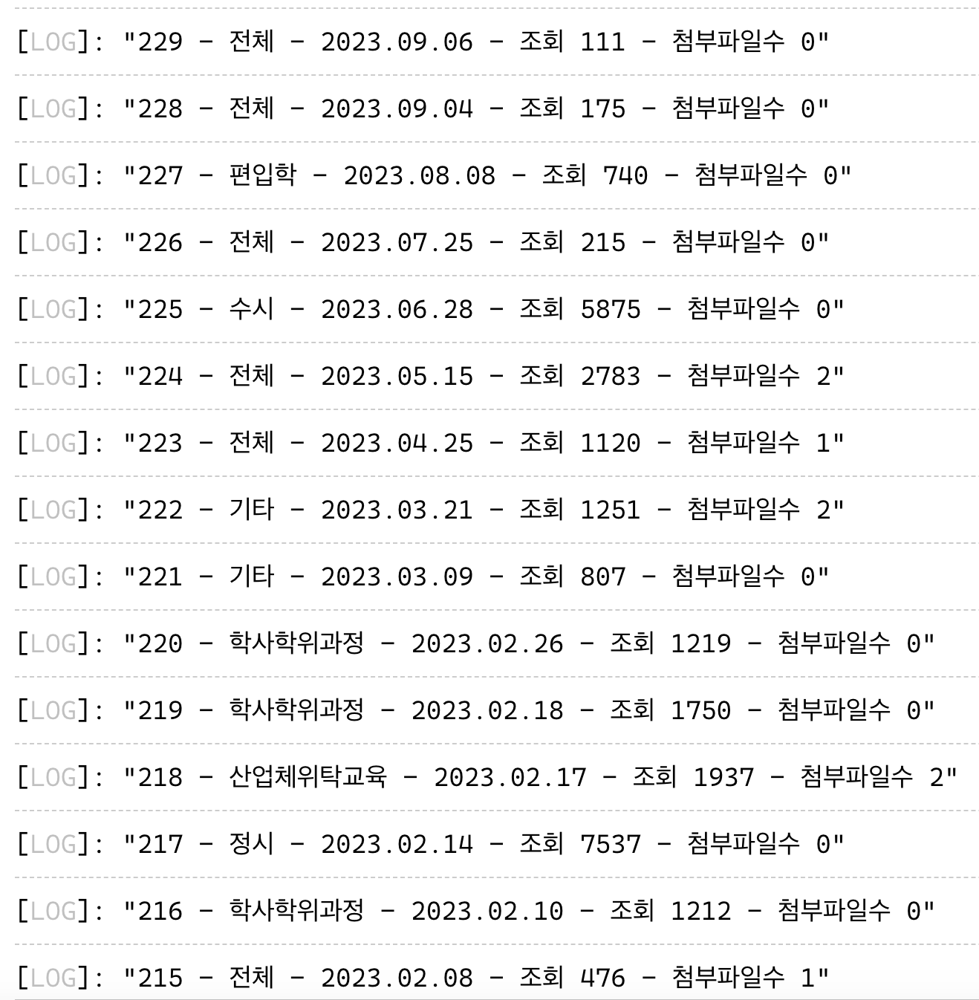

# 1번 내용의 주어진 지침

```ts
function calculateAverage(scores: number[]) {
  let total = 0;
  let count = 0;
  for (const score of scores) {
    if (score) {
      total += score;
      count++;
    }
  }
  return total / count;
}
```

위 함수의 문제점을 찾아보세요. 위 함수가 문제가 발생하는 케이스를 작성하고 해결하기 위해서 어떻게 해야할지 코드를 수정해보세요.
타입스크립트 코드를 작성하고 주석을 이용해 수정한 내용과 설명을 작성해주세요.

---

<br>

# 2번 내용의 주어진 지침

```ts
function printBoard(result: any) {
  console.log(result)
}

fetch('https://static-contents-serve.s3.ap-northeast-2.amazonaws.com/response.json').then((result)=>{
  return result.json()
}).then(list => {
  list.forEach((data: any)=>{
    printBoard(data)
  })
}).catch(err => {
  console.log(err)
});
```

위 코드에서 
```ts
function printBoard(result: any) {
  console.log(result)
}
```
이 부분만 수정해서 아래와 같이 출력되도록 수정해보세요.

그리고 result: any 부분을 아래의 출력에 필요한 데이터만 받도록 처리하고 type 선언을 해주세요.



---