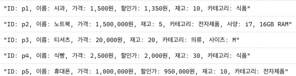

# 1번 내용의 주어진 지침

```ts
const data = [{
    "id": "p1",
    "name": "사과",
    "price": 1500,
    "stock": 10,
    "category": "식품",
    "discount": "10%"
  },
  {
    "id": "p2",
    "name": "노트북",
    "price": 1500000,
    "stock": 5,
    "category": "전자제품",
    "spec": "i7, 16GB RAM"
  },
  {
    "id": "p3",
    "name": "티셔츠",
    "price": 20000,
    "stock": 20,
    "category": "의류",
    "size": "M"
  },
  {
    "id": "p4",
    "name": "식빵",
    "price": 2500,
    "stock": 30,
    "category": "식품",
    "discount": 500
  },
  {
    "id": "p5",
    "name": "휴대폰",
    "price": 1000000,
    "stock": 10,
    "category": "전자제품",
    "discount": "5%"
}]
```
### 위의 데이터세트를 아래와 같이 출력하도록 코드를 작성해보세요.


위와 같이 출력하기 위해 처리해야 하는 로직에 대한 설명을 주석으로 작성해주세요.

- price 출력 부분
- discount가 존재할 시 할인가에 적용하여 출력
- 옵셔널값 체크

작성하는 코드에서 타입을 반드시 정의해주세요.

---