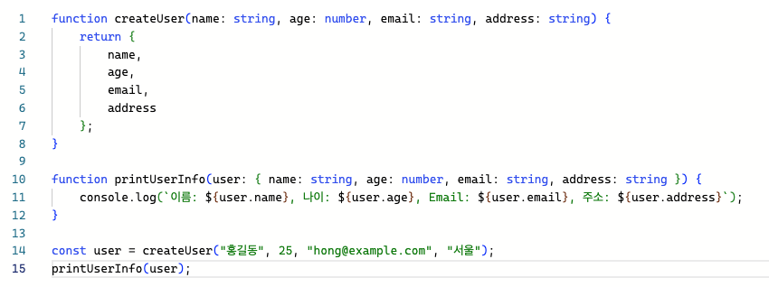

# 1번 내용의 주어진 지침



1. Type Aliases 를 사용하여 위의 코드를 리펙토링해 보세요.

2. Interfaces를 사용하여 위의 코드를 리펙토링해 보세요.

---

# 2번 내용의 주어진 지침

```ts
const data = [
  {
    "type": "dog",
    "name": "맥스",
    "age": 5,
    "weight": 20,
    "breed": "리트리버"
  },
  {
    "type": "dog",
    "name": "루루",
    "age": 2,
    "weight": 10,
    "breed": "푸들"
  },
  {
    "type": "cat",
    "name": "미미",
    "age": 3,
    "weight": 4,
    "color": "검정"
  },
  {
    "type": "cat",
    "name": "코코",
    "age": 1,
    "weight": 3,
    "color": "흰색"
  }
]
```

위 링크에서 포함된 데이터 세트에 대한 타입과 인터페이스를 지정하세요.
그리고 강아지 또는 고양이만 console로 출력하는 함수를 만들어 보세요.

ex)
printData("dog")
printData("cat")

---

<br>

```ts
const data = [{
    "id": "p1",
    "name": "사과",
    "price": 1500,
    "stock": 10,
    "category": "식품",
    "discount": "10%"
  },
  {
    "id": "p2",
    "name": "노트북",
    "price": 1500000,
    "stock": 5,
    "category": "전자제품",
    "spec": "i7, 16GB RAM"
  },
  {
    "id": "p3",
    "name": "티셔츠",
    "price": 20000,
    "stock": 20,
    "category": "의류",
    "size": "M"
  },
  {
    "id": "p4",
    "name": "식빵",
    "price": 2500,
    "stock": 30,
    "category": "식품",
    "discount": 500
  },
  {
    "id": "p5",
    "name": "휴대폰",
    "price": 1000000,
    "stock": 10,
    "category": "전자제품",
    "discount": "5%"
}]

function discountValue(discount: string|number, price:number){
  let resultString : string= '';

  if(typeof discount === 'number'){
      resultString += `,할인가: ${(price - discount).toLocaleString()}원`;
    } else if(typeof discount === 'string'){
      resultString += `, 할인가 : ${(price * (1 - parseInt(discount)/100)).toLocaleString()}원`;
    }
  return resultString
}

data.forEach((product : {id:string, name:string, price:number, stock:number, category:string, discount?:string|number, size?:string, spec?:string}) => {
  const { id, name, price, discount, stock, category, size, spec } = product;
  let resultString = `ID:${id}, 이름:${name}, 가격:${price.toLocaleString()}원`;

  if(discount) resultString += discountValue(discount,price);
  
  resultString += `, 재고:${stock}, 카테고리:${category}`

  if(size) resultString += `, 사이즈:${size}`
  if(spec) resultString += `, 사양:${spec}`

  console.log(resultString)
})
```

지금까지 배운 내용을 바탕으로 지난시간에 진행했던 실습을 리펙토링 해 보세요.
여러분들 코드로 하셔도 되고 위 링크를 기반으로 하셔도 됩니다.

- type 또는 interface 사용
- literal types 적용

---